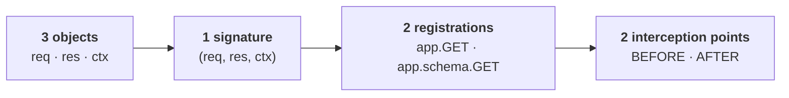

# Mastery 🏆

**Checkmate.**

Thirty minutes ago you had never seen Heaven. You now know the whole framework — not a useful subset of it, the whole thing.

## What you know

Everything else is a detail hanging off those four ideas:

- **Routing** is `app.METHOD(path, handler)`, with `:params`, `*` wildcards, and typed query strings.
- **Middleware** is a `BEFORE` or `AFTER` hook — the same function shape as a handler.
- **Validation** is a `TypedDict` registered on the sidecar, which also writes your API docs.
- **State** is `app.keep()` for the process and `ctx` for the request.
- **Testing** is `app.earth`, in-process, returning the same three objects.

## Where to go next

- **Reference**

    ---

    [API Reference](api.md) — every method, one page
    [Performance](performance.md) — benchmarks, honestly reported
    [Recipes](examples.md) — auth, pagination, real patterns

- **Operations**

    ---

    [Going to Production](production.md) — headers, CSP, secrets
    [Plugins](plugins.md) — extending Heaven
    [Marketplace](marketplace.md) — community plugins

## Before you ship

The [production checklist](deployment.md#the-pre-flight-checklist) is short and each item exists because it bites people. The two that matter most:

!!! warning "Leave `debug` off, and let your proxy serve static files"
    Debug mode serves tracebacks to clients, so keep it to development. `app.ASSETS()` is safe to leave mounted, but a proxy or CDN will serve those files faster. Both are covered in [Security](security.md) and [Templates & Assets](html.md).

## Contributing

Heaven is small enough to read in an afternoon — roughly 2,400 lines across fifteen modules. That is by design, and it means a first contribution is genuinely approachable.

[Star the repo, file an issue, or open a PR →](https://github.com/rayattack/heaven)

> "Simplicity is the ultimate sophistication." — *Leonardo da Vinci*

May your response times be low and your uptime high. ⚡
