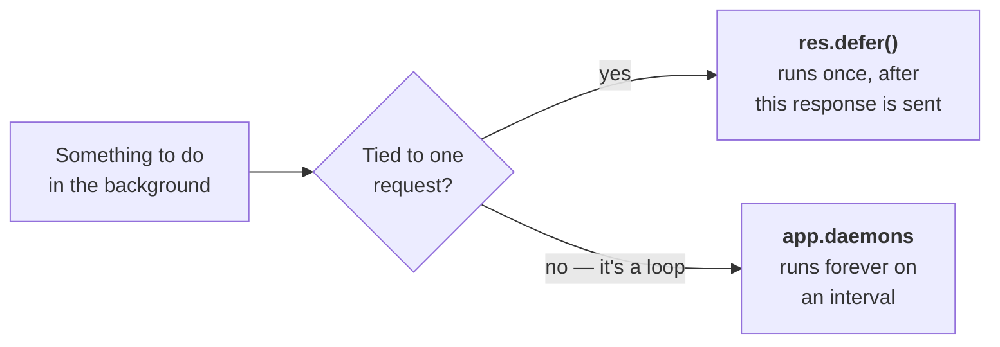
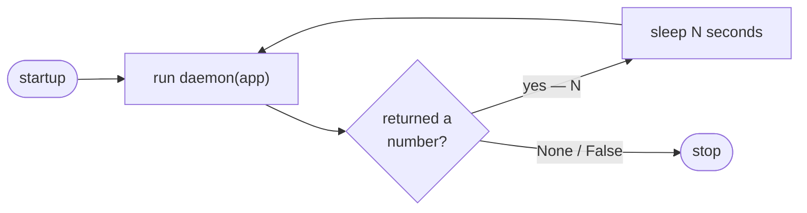

# Min 25-26 — Background Work 👻

Heaven has two ways to do work outside the request/response cycle, and picking the right one matters.



| | `res.defer(fn)` | `app.daemons = fn` |
| :--- | :--- | :--- |
| Runs | once, after the response | repeatedly, from startup |
| Receives | the app | the app |
| Good for | a receipt email, an audit write | cache cleanup, heartbeats, queue polling |

## Deferred work

```python
async def send_receipt(app):
    await mailer.send(...)

async def checkout(req, res, ctx):
    res.body = {'status': 'ok'}
    res.defer(send_receipt)      # runs after the client has its response
```

!!! warning "Must be `async`, and takes no arguments but the app"
    A sync function raises `TypeError` after the response has already been sent, where nothing can catch it. There's also no argument passing — capture what you need in a closure:

    ```python
    async def checkout(req, res, ctx):
        order_id = req.data['id']

        async def send(app):                 # closes over order_id
            await mailer.send(order_id)

        res.defer(send)
    ```

    Deferred callbacks also do not run under the [Earth](earth.md) test client, and the connection stays open until they finish — keep them short.

## Daemons

A daemon is a function that takes the app and returns **how many seconds to wait before running again**. Return `None` and it runs once and stops.

```python
async def cleanup_tokens(app):
    db = app.peek('db')
    await db.execute('DELETE FROM tokens WHERE expires_at < NOW()')
    return 60          # again in a minute

app.daemons = cleanup_tokens
```

Assign `app.daemons` more than once to register several — it appends rather than replaces.



### Sync daemons are fine

A sync daemon runs in a thread pool executor, so it won't block the event loop:

```python
def rebuild_report(app):
    heavy_pandas_thing()
    return 3600          # hourly

app.daemons = rebuild_report
```

Genuinely CPU-heavy work still belongs in a separate process — the GIL doesn't care that you used a thread.

!!! danger "Never block the loop in an async daemon"
    `time.sleep()`, a synchronous database driver, or a `requests` call inside an `async def` daemon freezes **the entire server** — every concurrent request included. Use `await asyncio.sleep()`, async drivers, or make the daemon sync so it gets a thread.

### Catching a blocked loop

Heaven ships a watchdog that tells you when something has stalled the loop:

```python
app = App(monitor=0.1)     # warn if the loop is blocked > 100ms
```

```
WARNING:heaven.monitor:Event Loop Blocked! Lag: 0.1504s
```

Turn it on in development. It converts "the server feels slow sometimes" into a specific line of code.

!!! warning "Daemons don't survive mounting"
    A daemon registered on a child app is dropped when that app is mounted onto a parent — it never starts. Register daemons on the app you actually run.

## When you need a real queue

Daemons run **inside your web process**. That means they stop when it stops, they don't retry, they aren't distributed, and with multiple workers *every worker runs its own copy*.

For work that must not be lost — payments, anything with retry semantics, anything that shouldn't run four times because you set `--workers 4` — use Celery, Dramatiq, or ARQ. Daemons are for periodic in-process chores, not for a job queue.

---

**Next:** Signing, sessions, and secrets → **[Min 27-28 — Security & Sessions](security.md)**
