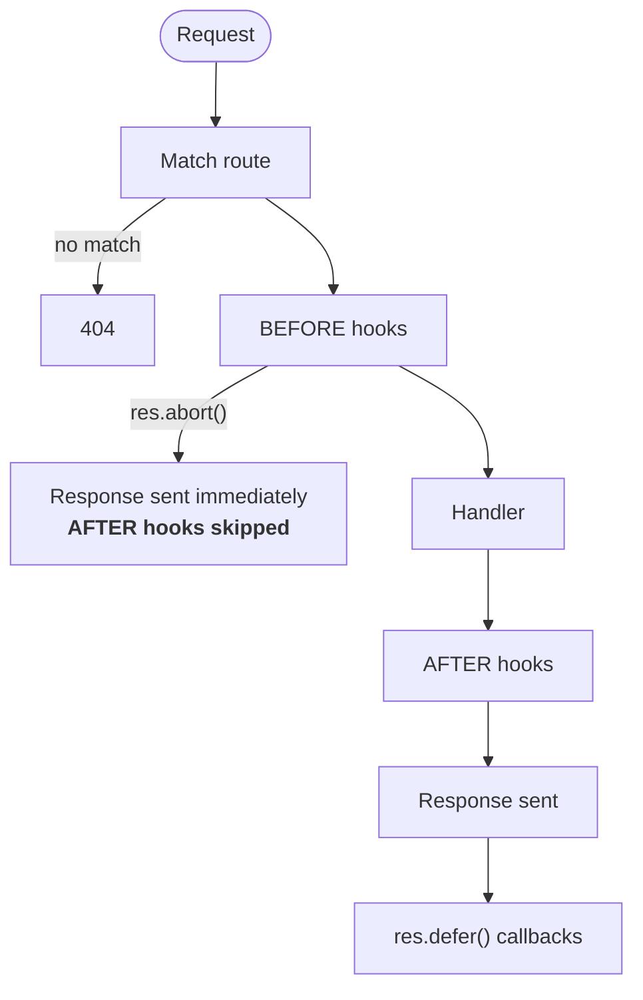

# Min 17-18 — Hooks 🪝

Heaven has no middleware stack. Instead of wrapping your app in layers of opaque callables, you register **hooks** that run `BEFORE` or `AFTER` a request.

A hook is just a handler. Same signature, same objects, no special base class:

```python
async def check_auth(req, res, ctx):
    ...
```

## The request lifecycle



Everything you'd reach for middleware to do — auth, logging, rate limiting, headers, timing — is a `BEFORE` or an `AFTER` hook.

## Registering hooks

Hooks are matched by path pattern, with `*` as a wildcard suffix.

```python
app.BEFORE('/*', log_request)              # every request
app.BEFORE('/api/*', rate_limiter)         # everything under /api
app.AFTER('/users/:id', log_access)        # one specific route
```

### Scoping to methods

Pass `methods=` to run a hook only for certain verbs:

```python
app.BEFORE('/orders', validate_payload, methods=['POST', 'PUT'])
```

Scoping belongs to the registration, not to the function, so the same function can be registered in several places with different scopes:

```python
app.BEFORE('/x', shared, methods=['POST'])
app.BEFORE('/y', shared)      # unscoped here; runs for every method on /y
```

Bound methods and other callables work too, which is what plugins normally register.

## Execution order

Hooks run in the order they were registered, **within the same pattern**. Across patterns, `BEFORE` runs from the broadest pattern inward, and `AFTER` unwinds in the mirror order, so a pair registered on the same pattern brackets everything more specific.

```python
app.BEFORE('/*', global_auth)          # registered first
app.BEFORE('/dashboard', page_hook)    # registered second
```

Order for `GET /dashboard`:

```
global_auth  →  page_hook  →  handler  →  (AFTER: page_hook, then global_auth)
```

With three levels of nesting the symmetry is easier to see. For `GET /users/7` matching `/users/:id`:

```
BEFORE:  /*  →  /users/*  →  /users/:id  →  handler
AFTER:                       /users/:id  →  /users/*  →  /*
```

This is what you want for guards: a check registered on `/*` runs before every more specific hook, so authentication registered globally genuinely precedes the route hooks it protects. Scoping a guard to the prefix it defends (`/admin/*`) still works and remains the clearer choice when the guard only applies to part of the app.

Each hook runs at most once per request even if several patterns match it. When a hook is registered under more than one matching pattern it runs at the earliest position it appears in.

## What a hook can do

```python
async def auth(req, res, ctx):
    user = await lookup(req.headers.get('authorization'))

    if not user:
        res.status = 401
        res.abort('Unauthorized')       # stop here — handler never runs

    ctx.user = user                     # hand data to the handler
```

- **Read the request** — headers, cookies, body, params.
- **Write to the context** — this is how hooks talk to handlers.
- **Set response headers or status** — an `AFTER` hook can decorate any response.
- **Abort** — `res.abort(body)` ends the request immediately.

!!! warning "`abort()` skips every AFTER hook"
    That includes Heaven's own session-saving hook. If a `BEFORE` hook aborts — or a schema validation fails with a 422 — session writes made during that request are silently discarded.

## A worked example: request timing

```python
import time

async def start_timer(req, res, ctx):
    ctx.started = time.perf_counter()

async def record_timing(req, res, ctx):
    elapsed = (time.perf_counter() - ctx.started) * 1000
    res.headers = 'X-Response-Time', f'{elapsed:.1f}ms'

app.BEFORE('/*', start_timer)
app.AFTER('/*', record_timing)
```

This is the pattern for nearly all middleware in Heaven: stash something in `ctx` on the way in, use it on the way out.

## Hooks and mounting

When you mount a child app onto a parent, hooks nest the way you'd want:

- **`BEFORE`**: parent hooks, then child hooks — broad guard before specific logic.
- **`AFTER`**: child hooks, then parent hooks — specific cleanup unwinds first.

## CORS is just a hook

```python
app.cors(origin=['https://myapp.com'], credentials=True)
```

Under the hood this registers a `BEFORE('/*')` hook that sets the `Access-Control-*` headers and a catch-all `OPTIONS` route that short-circuits preflights. Nothing you couldn't write yourself in fifteen lines — see [The Router](router.md#cors) for the options.

---

**Next:** Contracts, validation, and typed bodies → **[Min 19-20 — Schemas & Validation](schema.md)**
