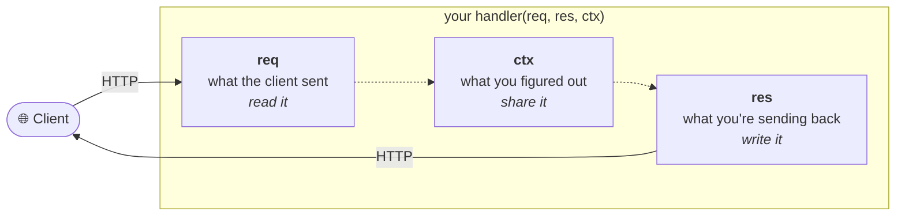

# Heaven

## An async Python web framework you can master in 30 minutes

Heaven was born from a simple idea: **you shouldn't need a PhD in web development to ship a web application.**

Most frameworks ask you to learn *them* before you can use HTTP. Layers of abstraction, decorator stacks, dependency graphs, magic function signatures. Heaven has none of that. There are three objects and one function shape, and once you know them you know the whole framework.

```python
from heaven import App

app = App()

async def hello(req, res, ctx):
    res.body = {'message': 'Checkmate.'}

app.GET('/', hello)
```

That is the entire mental model. **Every** handler in Heaven — route, hook, or websocket — is a plain function that receives the request, the response, and a context. No decorators, no injected parameters, no return-value conventions.

---

## Request throughput: Heaven vs FastAPI

Both frameworks driven through their raw ASGI callable in-process — no sockets, no uvicorn — so the numbers isolate routing, request/response construction, validation, and serialization. Async handlers on both sides.

| Scenario | Heaven | FastAPI | FastAPI + ORJSONResponse |
| :--- | ---: | ---: | ---: |
| `GET /users/:id` → small JSON | **18,237/s** | 6,529/s | 7,387/s |
| `POST /orders` → validated in and out | **11,292/s** | 6,716/s | 6,921/s |

Heaven is **2.5–2.8× faster** on the simple GET and **~1.6× faster** on the validated POST.

## The three objects

Heaven splits a request into three roles and keeps them strictly separate. This one idea explains most of the framework.



- **`req`** — the parsed request. Params, queries, headers, cookies, body, validated data.
- **`ctx`** — request-scoped scratch space. The place hooks and handlers pass things to each other.
- **`res`** — the reply you are building. Status, headers, body, files, streams.

If you can remember *read / share / write*, you can remember Heaven.

---

## Why another Python framework?

Heaven exists because of three specific frustrations:

| Frustration | Heaven's answer |
| :--- | :--- |
| Framework magic you can't step through in a debugger | Handlers are ordinary functions. Registration is an ordinary method call. |
| Dependency-injection graphs that grow their own gravity | There is no DI. You have `ctx` for per-request state and `app.keep()` for app state. |
| Import blocks 50 lines long, and circular-import whack-a-mole | Pass handlers as strings: `app.GET('/users', 'controllers.users.index')`. Resolved lazily. |

!!! tip "The string paradigm"
    Anywhere Heaven accepts a handler, it also accepts a dotted import path. This works for routes, hooks, lifecycle callbacks, daemons, and schemas — and it is the single biggest quality-of-life feature in the framework.

    ```python
    app.GET('/users', 'controllers.users.index')   # imported when the route is registered
    app.BEFORE('/admin/*', 'middleware.auth.guard')
    app.ON('startup', 'db.connect')
    ```

---

## Your 30 minutes

Each chapter is roughly two minutes. Read them in order — they build on each other, and the whole path is designed to be finished in one sitting.

<div class="grid cards" markdown>

- **Minutes 1–8 · Getting moving**

    ---

    [Min 01-02 — The Beginning](quickstart.md) · zero to a running server
    [Min 03-04 — The Command Line](cli.md) · `fly`, `run`, and introspection
    [Min 05-06 — The Router](router.md) · routes, params, lifecycle
    [Min 07-08 — Subdomains & Mounting](subdomains.md) · multi-tenancy and modular apps

- **Minutes 9–18 · The request cycle**

    ---

    [Min 09-10 — The Request](request.md) · reading what arrived
    [Min 11-12 — The Response](response.md) · JSON, files, streams, SSE
    [Min 13-14 — Templates & Assets](html.md) · Jinja2 and static files
    [Min 15-16 — The Context](context.md) · sharing state safely
    [Min 17-18 — Hooks](hooks.md) · BEFORE/AFTER interception

- **Minutes 19–30 · Shipping it**

    ---

    [Min 19-20 — Schemas & Validation](schema.md) · typed, validated bodies
    [Min 21-22 — API Docs](openapi.md) · OpenAPI and Scalar UI
    [Min 23-24 — Testing with Earth](earth.md) · in-process testing
    [Min 25-26 — Background Work](daemons.md) · daemons and deferred tasks
    [Min 27-28 — Security & Sessions](security.md) · signing and cookies
    [Min 29-30 — Deployment](deployment.md) · going live

</div>

---

## What Heaven is not

Heaven is deliberately small, and being honest about that is more useful than a feature list.

- **It is not batteries-included.** No ORM, no admin, no auth system, no migrations. Bring your own.
- **It does not do dependency injection.** If you want a database handle in a handler, put it on the app at startup and read it back: `app.keep('db', pool)` → `req.app.peek('db')`.
- **It does not validate path or query parameters against a schema.** Schema validation covers the JSON body. Path and query params get lightweight type coercion instead (`/users/:id:int`).
- **It has no middleware stack.** Hooks are flat callbacks that run before and after your handler; they cannot wrap it.

If you need the full FastAPI feature surface, use FastAPI. If you want something small enough to read in an afternoon and fast enough to not think about, keep going.

---

## Ready?

<div class="termy">

```console
$ pip install heaven

---> 100%
Successfully installed heaven
```

</div>

```python
from heaven import App

app = App()

app.GET('/', lambda req, res, ctx: setattr(res, 'body', {'message': 'Checkmate.'}))
```

**The move is yours.** → [Start the clock](quickstart.md)
