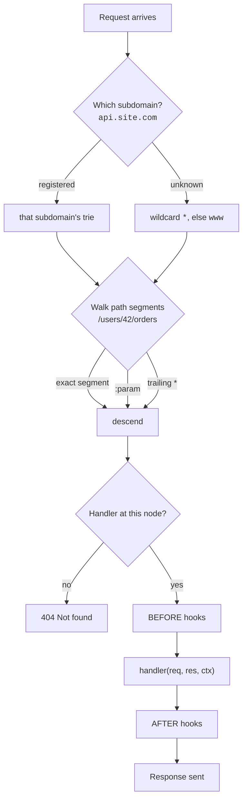

# Min 05-06 — The Router 🛣️

The router decides where a request goes, what runs before it, and what runs after. It is the one object you configure; everything else follows from it.

```python
from heaven import App

app = App()   # App, Application, Router and Server are the same class
```

## Registering routes

```python
app.GET   ('/users',     get_users)
app.POST  ('/users',     create_user)
app.PUT   ('/users/:id', replace_user)
app.PATCH ('/users/:id', update_user)
app.DELETE('/users/:id', delete_user)
```

Also available: `HEAD`, `OPTIONS`, `TRACE`, `CONNECT`, plus `HTTP(route, handler)` to register one handler across every method, and `SOCKET` / `WS` / `WEBSOCKET` for websockets.

`HEAD` is answered by the matching `GET` route automatically, with the same status and headers but no body, so you only need `app.HEAD()` when a `HEAD` request should be handled differently from its `GET`.

A method mismatch returns **405** with an `Allow` header listing the methods that route does accept. A path that matches nothing returns 404.

!!! warning "`OPTIONS` is not auto-answered"
    Unless you call `app.cors()`, which registers a catch-all for you, `OPTIONS` requests are only served if you register a handler yourself.

## Path parameters

Prefix a segment with `:` to capture it. Read it back from `req.params`.

```python
app.GET('/users/:id/orders/:order_id', handler)

async def handler(req, res, ctx):
    user_id  = req.params.get('id')        # '42'  (a string)
    order_id = req.params.get('order_id')  # 'abc' (a string)
```

Append a type to have Heaven convert it for you:

```python
app.GET('/users/:id:int', handler)   # req.params.get('id') -> 42, an int
```

The same seven type names work in path segments and in query strings:

| Type | Example segment | You get |
| :--- | :--- | :--- |
| `int` | `/users/:id:int` | `42` |
| `float` | `/price/:amount:float` | `19.99` |
| `bool` | `/flag/:on:bool` | `True`, from `true`/`false`/`1`/`0` |
| `str` | `/tag/:name:str` | `'sale'`, the no-op |
| `date` | `/report/:day:date` | `date(2026, 8, 1)` |
| `datetime` | `/log/:at:datetime` | `datetime(2026, 8, 1, 10, 30)` |
| `uuid` | `/item/:sku:uuid` | `UUID('3f2504e0-...')` |

`date` and `datetime` parse ISO 8601, the same format `date.fromisoformat` accepts.

!!! tip "A value that will not convert is a miss, not a string"
    `/users/:id:int` does not match `/users/abc`, so the request falls through to whatever else matches, or 404. Your handler never receives an unconverted string where it asked for a type. If a wildcard covers the same prefix, that wildcard picks it up:

    ```python
    app.GET('/users/:id:int', by_id)
    app.GET('/users/*', by_slug)      # /users/abc lands here
    ```

!!! warning "Unknown type names are rejected at registration"
    `/users/:id:uuidd` raises `UrlError` when the route is registered rather than quietly handing back a string, so a typo surfaces at startup instead of in production.

### Wildcards

A trailing `*` captures the rest of the path into `req.params['*']`.

```python
app.GET('/files/*', serve)

async def serve(req, res, ctx):
    rest = req.params.get('*')    # 'reports/2026/q1.pdf'
```

### Typed query strings

Declare query parameters in the route string and Heaven coerces them on the way in. Unlike path params, **all six types work here**.

```python
app.GET('/search?page:int&since:date&exact:bool', search)

async def search(req, res, ctx):
    page  = req.queries.get('page')    # 3            int
    since = req.queries.get('since')   # date(2026,1,1)
    exact = req.queries.get('exact')   # True         bool
```

Supported: `:int`, `:float`, `:bool`, `:str`, `:date`, `:datetime`, `:uuid`.

!!! note "Coercion failures are silent"
    If a client sends `?page=banana`, Heaven does not raise — you get the raw string `'banana'` back. Validate anything you actually depend on.

## How a request finds its handler

Heaven keeps one route trie per HTTP method per subdomain and walks it segment by segment. There is no regex matching and no linear scan through a route list, which is a large part of why it is fast.



Trailing slashes are insignificant: `/users/`, `/users` and `//users` all match the same route. No redirect is issued.

## The string paradigm

Every place Heaven takes a handler, it also takes a dotted import path. The module is imported when the route is registered.

=== "Routes"

    ```python
    app.GET('/users', 'controllers.users.index')
    app.POST('/users', 'controllers.users.create')
    ```

=== "Hooks"

    ```python
    app.BEFORE('/dashboard/*', 'middleware.auth.check_token')
    ```

=== "Lifecycle"

    ```python
    app.ON('startup', 'db.connect')
    ```

Why it's worth using:

1. **No import blocks.** Your `app.py` stays a routing table instead of an import manifest.
2. **No circular imports.** Handlers that need the app no longer import the module that imports them.
3. **Readable diffs.** A new endpoint is one line in one file.

### Grouping handlers in a class

When a set of routes shares a subject, `Class#method` registers a method instead of a function. The class subclasses `heaven.Handler`:

```python
# controllers/orders.py
from heaven import Handler

class Orders(Handler):
    async def index(self):
        self.res.body = await self.req.app.peek('db').orders()

    async def show(self):
        self.res.body = await self.find(self.req.params.get('id'))

    async def find(self, reference):        # a plain helper, not a route
        ...
```

```python
app.GET('/orders', 'controllers.orders.Orders#index')
app.GET('/orders/:id', 'controllers.orders.Orders#show')
```

The three objects a function handler is handed arrive as `self.req`, `self.res` and `self.ctx`, so both styles are the same contract written differently. Methods can be sync or async, hooks accept the same form, and everything else (streaming, schemas, subdomains) works exactly as it does for functions.

**Heaven builds one instance per request.** `self` belongs to the request being served and is thrown away afterwards, so two requests in flight never share it. That also means instance attributes do not persist between requests: put shared state on the app with `app.keep()`, and per-request state on `self` or `ctx`.

!!! note "Subclassing is what types it"
    `Handler.__init__` carries the annotations, so `self.req`, `self.res` and `self.ctx` autocomplete in your editor without you writing any. Naming the schema, as in `class CreateOrder(Handler[Order])`, types `self.req.data` the same way `Request[Order]` does for a function.

    Do not override `__init__`: Heaven constructs the instance with exactly `(req, res, ctx)`. Per-request setup belongs at the top of the method.

Anything wrong with the string is raised at registration, not on the first request that reaches the route: a class that is not a `Handler` subclass, a method that does not exist or is not callable, or a spec missing its module path or method name all raise `HandlerError` while the app is still booting.

## Application lifecycle

Run code when the server boots and when it shuts down. Both callbacks receive the **app**, not a request.

```python
async def connect_db(app):
    app.keep('db', await Database.connect())   # store on the app

async def close_db(app):
    await app.peek('db').close()

app.ONCE(connect_db)          # same as app.ON('startup', connect_db)
app.ON('shutdown', close_db)
```

Read it back inside any handler through `req.app`:

```python
async def list_users(req, res, ctx):
    db = req.app.peek('db')
    res.body = await db.fetch('SELECT * FROM users')
```

!!! danger "Startup failures do not stop the server"
    If a startup callback raises, Heaven prints a notice and **starts anyway**. A failed database connection produces a running server that 500s on every request rather than a server that refuses to boot. If boot-time correctness matters, assert it yourself:

    ```python
    import sys

    #... more code ...

    async def connect_db(app):
        try: app.keep('db', await Database.connect())
        except Exception: sys.exit(1)     # fail loudly
    ```

## Application state: `keep`, `peek`, `unkeep`

`app.keep()` is Heaven's answer to dependency injection — one shared bucket, set at startup, read anywhere.

```python
app.keep('db', pool)          # store
pool = app.peek('db')         # read
pool = app.unkeep('db')       # read and remove
```

For type safety, use a `Key`:

```python
from heaven import Key

Pool = Key[Database]('db')

app.keep(Pool, pool)
db = app.peek(Pool)           # your type checker knows this is Database | None
```

!!! tip "App state vs context"
    `app.keep` lives for the life of the **process** — connection pools, config, clients. `ctx.keep` lives for the life of one **request** — the current user, a request id. Never put per-request data on the app; it leaks across requests.

## CORS

```python
app.cors()                                  # allow everything

app.cors(
    origin=['https://myapp.com'],           # a list reflects matching origins
    methods=['GET', 'POST'],
    headers=['Authorization', 'Content-Type'],
    credentials=True,
    max_age=3600,
)
```

`app.cors()` simply registers a `BEFORE('/*')` hook plus a catch-all `OPTIONS` route. Argument names are forgiving — `max_age`, `maxAge` and `MAX_AGE` all work, as do `origin`/`origins`.

!!! warning "`credentials=True` needs an explicit origin"
    The defaults are `origin='*'`, `methods='*'`, `headers='*'`. Browsers reject `Allow-Origin: *` together with credentials, and Heaven does not catch that combination for you. Pass a real origin list whenever you use cookies.

## Sessions

```python
app.sessions(secret_key='keep-it-secret', max_age=86400)
```

Then in any handler:

```python
ctx.session.user_id = 123      # write
uid = ctx.session.user_id      # read
```

Sessions are signed cookies — see [Min 27-28 — Security](security.md) for the details and the caveats.

## Where next

Hooks, mounting and daemons each get their own chapter:

- Middleware → [Min 17-18 — Hooks](hooks.md)
- Mounting and subdomains → [Min 07-08 — Subdomains & Mounting](subdomains.md)
- Background work → [Min 25-26 — Background Work](daemons.md)

---

**Next:** One app, many hostnames → **[Min 07-08 — Subdomains & Mounting](subdomains.md)**
