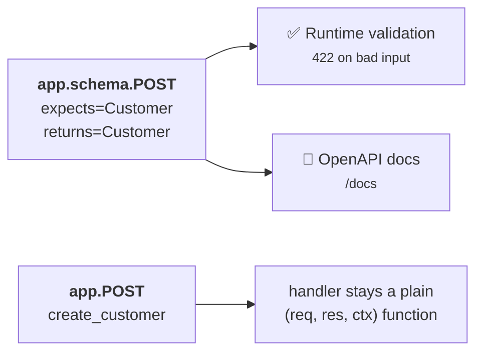
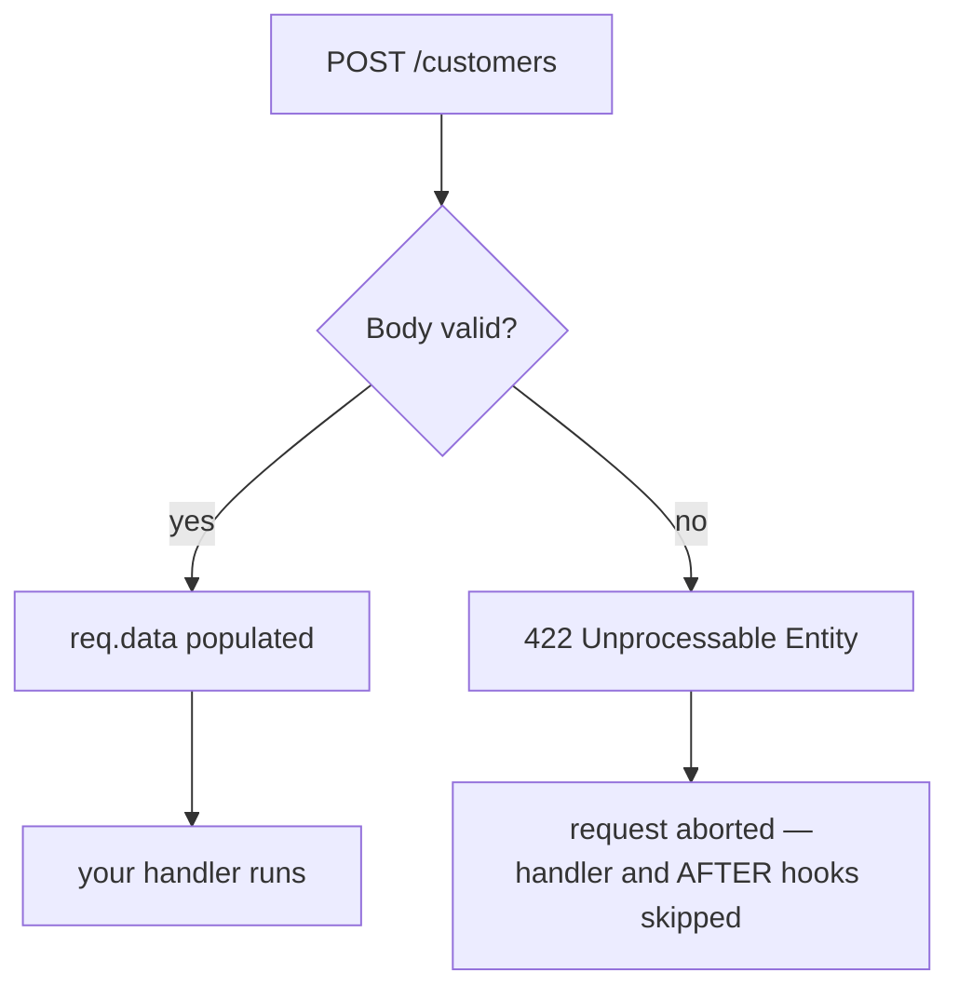

# Min 19-20 — Schemas & Validation 🛡️

Heaven validates request bodies with [pytastic](https://rayattack.github.io/pytastic/) — a zero-dependency validator built on **standard Python typing**. There is no new base class to learn and no model DSL. If you know `TypedDict` and `Annotated`, you already know how to write a Heaven schema.

## A schema is a TypedDict

```python
from typing import Annotated, List, Literal, TypedDict

class Customer(TypedDict):
    name:  Annotated[str, "min_len=2; max_len=80"]
    email: Annotated[str, "format=email"]
    age:   Annotated[int, "min=18; max=120"]
    tier:  Literal["free", "pro", "enterprise"]
    tags:  Annotated[List[str], "max_items=5"]
```

Constraints are a **string** in the `Annotated` metadata: `key=value`, separated by `;`. A field with no constraints needs no annotation at all — `name: str` is a perfectly good schema field.

!!! tip "Why strings and not a `Field()` object?"
    Because `TypedDict` stays a plain type. Your IDE autocompletes it, `mypy` checks it, and any other tool that understands typing understands your schema. Nothing is imported from Heaven to define one.

### Optional fields

Use `NotRequired` to make a key optional:

```python
from typing import NotRequired, Optional   # typing_extensions on Python < 3.11

class Customer(TypedDict):
    name: str
    referrer: NotRequired[Optional[str]]    # may be absent, may be null
```

### Nesting

Nest schemas by referencing them. Errors report the full path, so `.address.zip` tells you exactly where the problem is.

```python
class Address(TypedDict):
    city: Annotated[str, "min_len=2"]
    zip:  Annotated[str, "regex=^[0-9]{5}$"]

class Customer(TypedDict):
    name: str
    address: Address              # nested
    history: List[Address]        # list of nested
```

### The constraint cheat sheet

| Applies to | Constraints |
| :--- | :--- |
| Numbers | `min`, `max`, `exclusive_min`, `exclusive_max`, `step` (alias `multiple_of`) |
| Strings | `min_len`, `max_len` (aliases `min_length`/`max_length`), `regex` (alias `pattern`), `format` |
| Lists | `min_items`, `max_items`, `unique` |
| Objects | `min_props`, `max_props`, `strict` (reject unknown keys) |
| Any | `title`, `description`, `default` |

Built-in `format` values: `email`, `uuid`, `ipv4`, `uri`, `date-time`.

```python
class Event(TypedDict):
    id:       Annotated[str, "format=uuid"]
    host:     Annotated[str, "format=ipv4"]
    website:  Annotated[str, "format=uri"]
    starts:   Annotated[str, "format=date-time"]
    capacity: Annotated[int, "min=1; max=500; step=5"]
    slug:     Annotated[str, "regex=^[a-z0-9-]+$; description=URL-safe name"]
```

## Wiring a schema to a route — the sidecar

Heaven keeps schema registration **separate** from handler registration. You declare the contract on `app.schema`, and the handler on `app`.

```python
# 1. Declare the contract
app.schema.POST('/customers', expects=Customer, returns=Customer)

# 2. Register the handler — an ordinary function, no decorators
app.POST('/customers', create_customer)
```



**One registration, two jobs.** The same declaration drives runtime validation *and* the generated documentation, so they can never drift apart.

### Why a sidecar instead of decorators?

1. **Handlers stay pure.** No framework types in the signature, no decorator stack to read through, trivially unit-testable by calling the function.
2. **Schemas are relocatable.** Registration is just a method call, so you can keep contracts in their own module, register them conditionally, or build them in a loop.
3. **Subdomains come free.** `api.schema.POST(...)` works identically.

The trade-off is honest: the two calls are **not linked at the type level**. Keeping the route string in sync between them is on you, and so is keeping the handler's annotation in sync with `expects`.

## Reading validated data

Validated input lands on `req.data` as a **dict**:

```python
async def create_customer(req, res, ctx):
    customer = req.data
    res.status = 201
    res.body = {'id': 1, 'name': customer['name']}
```

Prefer attribute access? Register with `dot=True`:

```python
app.schema.POST('/customers', expects=Customer, dot=True)

async def create_customer(req, res, ctx):
    res.body = {'name': req.data.name}      # dot access
```

### Type-safe handlers

`Request` is generic. Annotate it and your IDE will autocomplete `req.data`:

```python
from heaven import Request, Response, Context

async def create_customer(req: Request[Customer], res: Response, ctx: Context):
    customer = req.data      # IDE knows the shape
```

!!! note "A convention, not an enforcement"
    Heaven does not check that `Request[Customer]` matches the `expects=Customer` you registered. Your type checker helps; the runtime does not care.

## What happens when validation fails



The response is **plain text**, naming the first field that failed:

```
Value 12 < 18.0 at .age
  - .age: Must be >= 18.0
```

!!! warning "Three things to know about the 422"
    - **It is plain text, not JSON.** If your clients expect a JSON error envelope, you must shape it yourself.
    - **Only the first error is reported.** pytastic stops at the first failure rather than collecting all of them.
    - **A 422 aborts the request**, so *no* `AFTER` hooks run. That includes session saving — anything you rely on in an AFTER hook silently will not happen on a validation failure.

!!! danger "Validation assumes a JSON body"
    The validating hook reads `req.json` regardless of `Content-Type`. Posting a form body to a schema'd route raises a JSON decode error that surfaces as an opaque **500**, not a 415 or 422. Keep schema'd routes JSON-only.

## Validating the response

`returns=` validates what you send back, which is how you stop internal fields leaking out.

```python
class PublicProfile(TypedDict):
    id: int
    name: str

app.schema.GET('/me', returns=PublicProfile, protect=True)

async def me(req, res, ctx):
    res.body = {'id': 7, 'name': 'Ada', 'password_hash': '$2b$deadbeef'}
```

The client receives `{"id":7,"name":"Ada"}` — `password_hash` is stripped because it isn't in the schema.

| Option | Effect |
| :--- | :--- |
| `protect=True` | Strip any field not declared in the schema. **Your leak protection.** |
| `partial=True` | Allow a subset of fields — useful for `PATCH` responses. |
| `strict=True` | Return 500 if the response doesn't satisfy the schema, instead of sending it anyway. |

These default to the app-wide settings you pass to `App(protect_output=..., allow_partials=..., fail_on_output=...)`.

### PATCH is partial automatically

Register `PATCH` and Heaven validates only the fields that were actually sent, so a client can update one field without resending the whole object.

```python
app.schema.PATCH('/customers/:id', expects=Customer)
# PATCH {"age": 41}  ->  valid; req.data == {'age': 41}
```

## What schemas do *not* cover

Worth stating plainly, because it differs from FastAPI:

- **Only the JSON body is validated.** Path params, query params, headers, cookies and form bodies are never checked against a schema. Path and query params get [lightweight coercion](router.md#typed-query-strings) instead.
- **There is no automatic 422 for a malformed query string.** `?page=banana` yields the string `'banana'`.

## Putting it together

```python
from typing import Annotated, List, Literal, TypedDict
from heaven import App, Request, Response, Context

app = App()

class Customer(TypedDict):
    name:  Annotated[str, "min_len=2; max_len=80"]
    email: Annotated[str, "format=email"]
    age:   Annotated[int, "min=18"]
    tier:  Literal["free", "pro", "enterprise"]

class CustomerOut(TypedDict):
    id: int
    name: str
    tier: str

async def create_customer(req: Request[Customer], res: Response, ctx: Context):
    db = req.app.peek('db')
    row = await db.insert(req.data)
    res.status = 201
    res.body = row                      # validated + stripped by returns=

app.schema.POST('/customers',
    expects=Customer,
    returns=CustomerOut,
    protect=True,
    summary="Create a customer",
    group="Customers",
)
app.POST('/customers', create_customer)
```

---

**Next:** That contract you just wrote can document itself → **[Min 21-22 — API Docs](openapi.md)**
