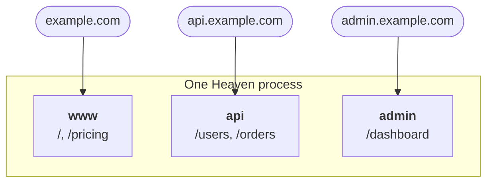

# Min 07-08 — Subdomains & Mounting 🏗️

Two ways to split a growing application: **subdomains** for routing by hostname, and **mounting** for combining separate app objects into one.



## Subdomains

Every subdomain gets its own independent routing table. `app.subdomain(name)` returns a proxy for registering against it:

```python
api = app.subdomain('api')
admin = app.subdomain('admin')

api.GET('/users', list_users)          # api.example.com/users
admin.GET('/dashboard', dashboard)     # admin.example.com/dashboard
```

Or pass `subdomain=` directly:

```python
app.GET('/users', list_users, subdomain='api')
```

Routes registered on `api` are **only** reachable through that hostname. `example.com/users` returns 404.

### Proxies are cheap and repeatable

`app.subdomain('api')` returns a fresh proxy each time, but they all write to the same routing table. Call it wherever you need it — no need to pass the object around:

```python
# users.py
api = app.subdomain('api')
api.GET('/users', list_users)

# orders.py
api = app.subdomain('api')      # safe — same table
api.GET('/orders', list_orders)
```

### Everything else is subdomain-aware

```python
api.BEFORE('/*', require_token)                  # hooks
api.schema.POST('/users', expects=CreateUser)    # schemas
api.doc('/docs', title='Public API')             # its own API reference
api.cors(origin=['https://app.example.com'])     # its own CORS policy
```

!!! note "Requests without a subdomain go to `www`"
    Heaven treats a host as having a subdomain only when it has **more than two dot-separated parts**. So `example.com` and `localhost` both resolve to the default `www` table. Register a `*` subdomain to catch everything unmatched.

!!! tip "Testing subdomains locally"
    `localhost` has no subdomain, so `api.localhost:8000` is the usual trick — it works in Chrome and Firefox without touching `/etc/hosts`. In tests, skip DNS entirely:

    ```python
    req, res, ctx = await earth.GET('/users', subdomain='api')
    ```

## Mounting

Mounting merges one Heaven app into another. It's how you split a large codebase into modules that are each independently runnable and testable.

```python
# api.py
from heaven import Router
api = Router()
api.GET('/v1/customers', list_customers)
```

```python
# pages.py
from heaven import Router
pages = Router()
pages.TEMPLATES('templates', relative_to=__file__)
pages.GET('/', home)
```

```python
# app.py
from heaven import Application
from api import api
from pages import pages

app = Application()
app.mount(api)
app.mount(pages, isolated=False)
```

`isolated=True` (the default) merges **routes only**. `isolated=False` also merges configuration, buckets, and template loaders, so the child can use resources the parent set up.

### Hook order when mounted

Hooks nest the way you'd hope — broad guards wrap specific ones:

```
parent BEFORE → child BEFORE → handler → child AFTER → parent AFTER
```

### What mounting will not do for you

!!! warning "No path prefix"
    Heaven has no `mount(child, prefix='/blog')`. Child routes mount at their **literal** paths, so a child's `/posts` is served at `/posts`, not `/blog/posts`. Include the prefix in the child's own route strings if you want one.

Daemons, startup callbacks and shutdown callbacks all come across with the child and run on the parent's lifespan. Each is handed the app it was registered on, so a child's daemon still reads the child's own buckets and configuration even though the parent is what actually runs.

## Which one should you use?

| Use | When |
| :--- | :--- |
| **Subdomains** | The split is a *hostname* concern: a public API, an admin panel, per-tenant hosts. |
| **Mounting** | The split is a *code organisation* concern: keeping a large app in separate modules. |

They compose — mount a child app and register its routes on a subdomain.

---

**Next:** Reading what the client actually sent → **[Min 09-10 — The Request](request.md)**
